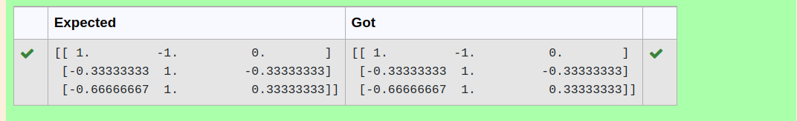

# INVERSE-OF-A-MATRIX
## Aim:
To write a python program to find the inverse of a matrix
## Equipment’s required:
1. 	Hardware – PCs
2. 	Anaconda – Python 3.7 Installation / Moodle-Code Runner
## Program:
```
import numpy as np
a = ([[2,1,1],[1,1,1],[1,-1,2]])
inverse = np.linalg.inv(a)
print(inverse)
```
## Output:


## Result:
Thus the inverse of given matrix is successfully solved using python program

